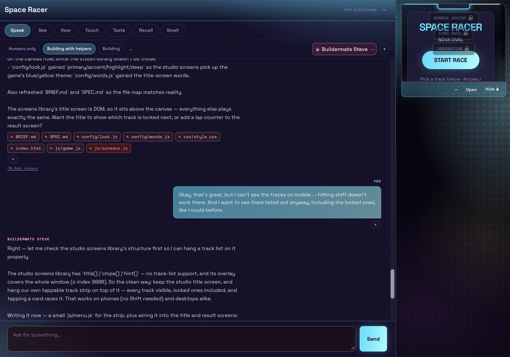
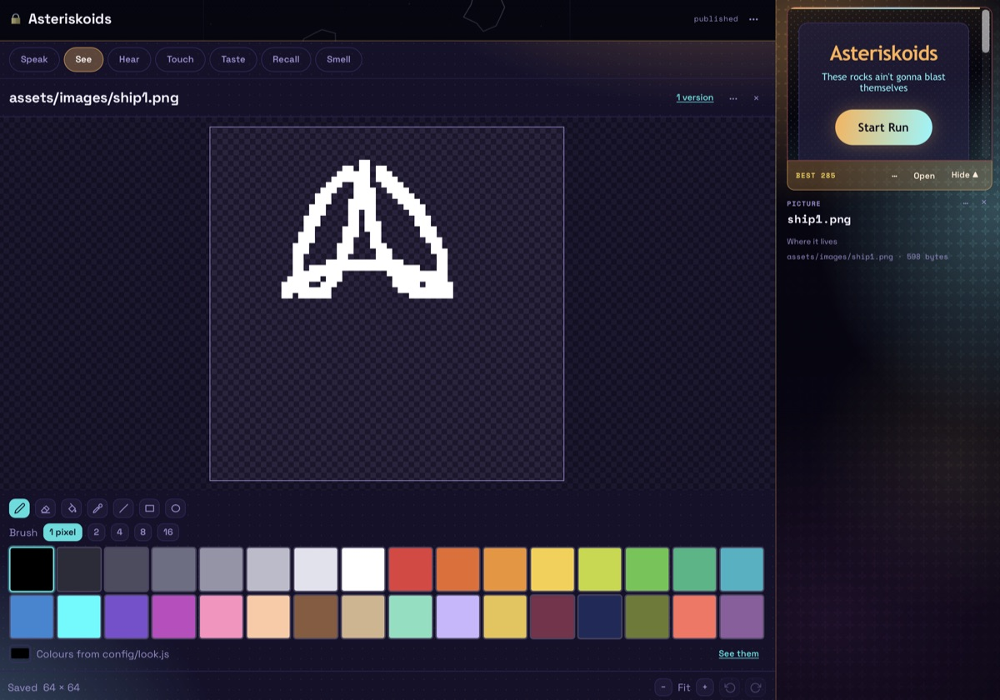
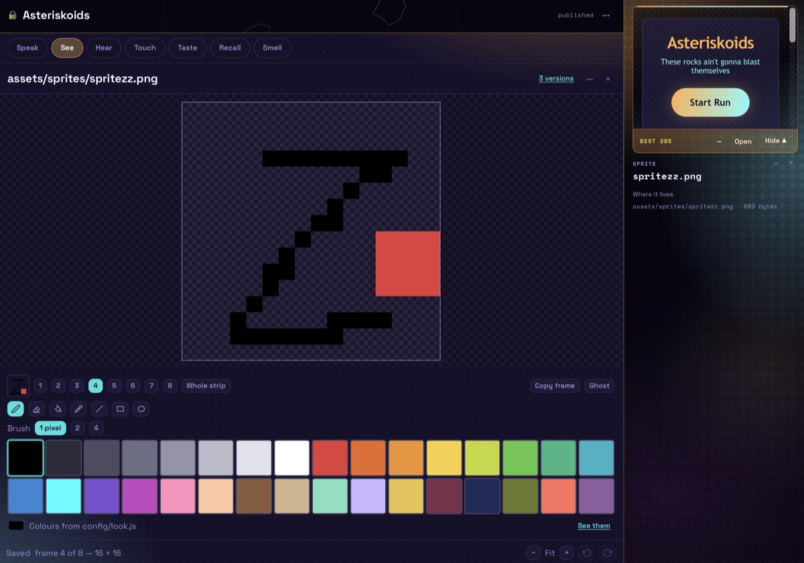
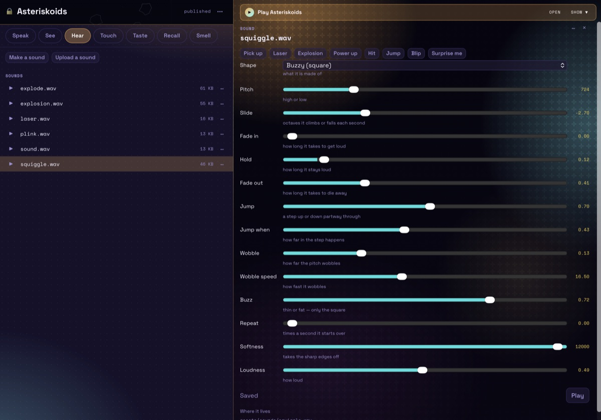
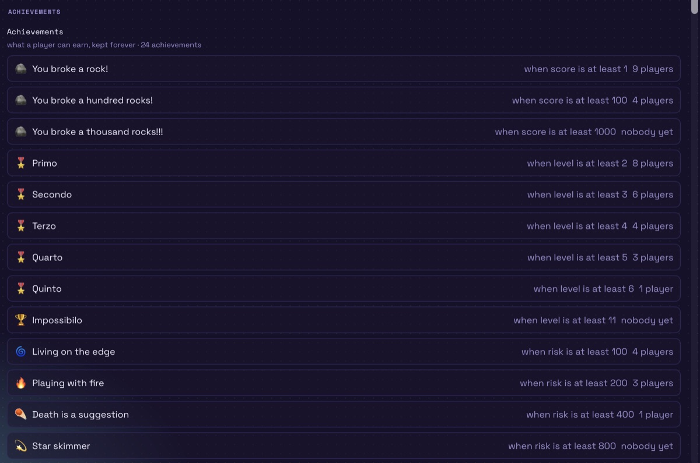
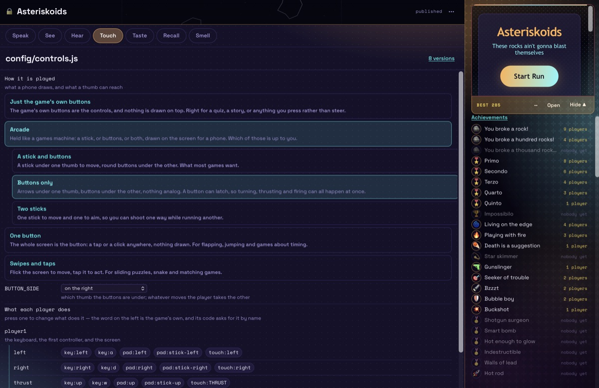
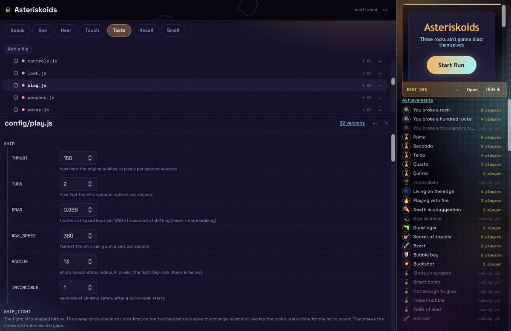
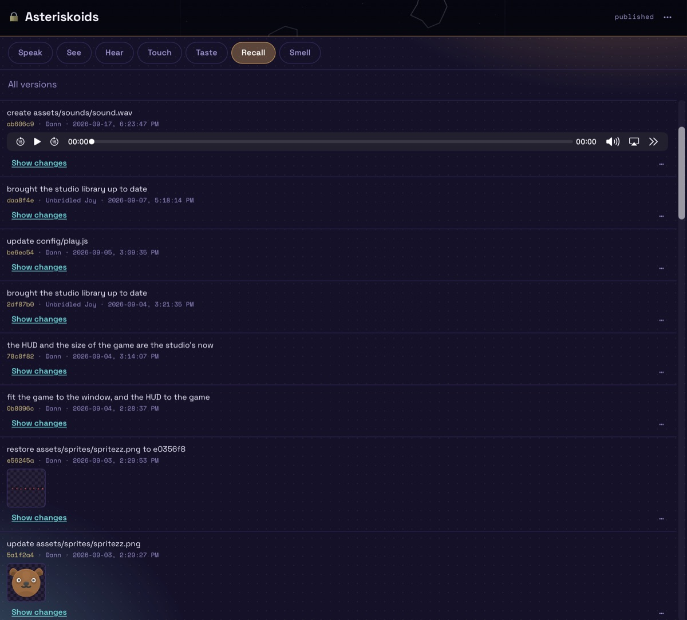
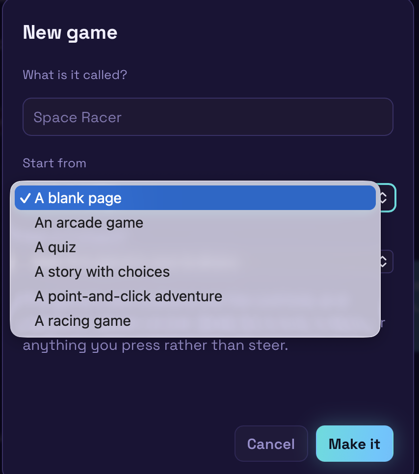

# Studio Joy

Hey, thanks for checking out this repo. 
This is a game studio for making games with your family and friends. 
It's designed for a small group of people who know and trust each other, so there's not many permissions or limitations. 

I made this for my kids and their cousins to make games together. 
They get to play each other's games, steal the high-score spots, 
leave comments on unfinished creations and glorious trainwrecks,
swap stories of close escapes and laugh about horrendous bugs.
It's not really finished yet, but it's good enough to make some kind of fun games, 
and make making games kind of fun, which has won me some best-uncle points. 

The LLM is currently set to deepseek -- you can set it to something else if you'd prefer, but you may want to also change how caching is handled to match.
It comes out to around a dollar a day for a dozen kids all going nuts making games (and you can set token limits if you want).
I have a background project to get a machine running a local model set up in my homelab; I'll probably switch this over once I do that.

Each of the games is actually a full git repo on the server, so the code is fully visible and editable, and you can roll back to previous versions. And all the game constants are in config files that have a nice form for editing, so all the game tuning can be done by hand, which is way faster than yelling at the LLM. (It doesn't hot-swap the constants in; maybe I'll add that as a feature someday.)

I'm slowly adding various game development features -- there's a sound editor, a pixel art editor, a sprite animation editor, stuff like that. 

It's also a PWA, so you can add it directly to your device as a standalone application.

I hope you and yours enjoy this as much as me and mine have.

-- dann


> --------------- Autotext ---------------

A game studio for a family, a classroom or a club: a few people and an AI
helper make browser games together, and anybody can play what they make.

A game is a chat beside a folder of files. Somebody says what they want —
*make the ship faster*, *add a level made of ice* — and the studio's helper,
the **builder**, plans the change, edits the files and the game reloads next
to the chat. Every edit is a git commit, so nothing is ever lost and any
earlier version can come back. A game can also be made with no helper at all:
the quiz, the story with choices, the point-and-click adventure, the racing
game, *Knock it down* and *Roll a ball* each come with their own editor.

It was built for kids. Every technical part is there — the file tree, the
versions, the diffs, the helper's reasoning — but the words on screen are
plain, and anything that throws something away asks first.

The helpers run on [DeepSeek](https://platform.deepseek.com). You bring the
API key and decide how much a day it may spend.

## A look around

The pills over a game — Speak, See, Hear, Touch, Taste, Recall, Smell — pick
what you are working on.

<p align="center">
  
  <br><sub><b>Speak</b> — say what you want; the helper changes the files and the game reloads beside the chat</sub>
</p>

<table>
  <tr>
    <td width="50%"><br><sub><b>See</b> — the pixel editor</sub></td>
    <td width="50%"><br><sub><b>See</b> — a sprite's animation, frame by frame</sub></td>
  </tr>
  <tr>
    <td width="50%"><br><sub><b>Hear</b> — sound effects from sliders, starting from presets like Laser and Jump</sub></td>
    <td width="50%"><br><sub><b>Smell</b> — achievements, each with the rule that earns it</sub></td>
  </tr>
  <tr>
    <td width="50%"><br><sub><b>Touch</b> — how it's played: keys, a controller, or buttons drawn on a phone</sub></td>
    <td width="50%"><br><sub><b>Taste</b> — the files, with a game's settings as a form to tune by hand</sub></td>
  </tr>
  <tr>
    <td width="50%"><br><sub><b>Recall</b> — every change is a version you can look at or bring back</sub></td>
    <td width="50%" align="center"><br><sub>A new game starts blank or from a template</sub></td>
  </tr>
</table>

## What you need

- A Linux server you can SSH into, with **Node 24 or newer** and **git**.
  Nothing else: there are no packages to install and no build step.
- **Two hostnames** pointing at it — one for the studio, one for the games,
  say `studio.example.com` and `games.example.com`. Why two is below; it is
  the one part not to skip.
- A **reverse proxy** that does TLS. The example is
  [Caddy](https://caddyserver.com), which gets its own certificates.
- A **DeepSeek API key**. Every helper reply is billed to it. The studio stops
  for the day at `DAILY_TOKEN_BUDGET` tokens (5 million by default), and each
  person has their own allowance under that, set in the admin panel.
- Something to keep the process up. The example is
  [pm2](https://pm2.keymetrics.io).

## Try it on your own machine first

Clone this repository, then:

```sh
npm run adduser -- you@example.com "Your Name"    # asks for a password
DEEPSEEK_API_KEY=sk-... npm start
```

The studio is at <http://localhost:8100> and the games at
<http://localhost:8101>. The first account is the admin. The database is
`gamestudio.db` and the games are in `games/`, both beside the code and both
ignored by git.

On a home network this is enough to use it for real. Play links follow
whatever hostname reached the studio, so `my-laptop.local:8100` plays games at
`my-laptop.local:8101` with nothing configured. Read *Why two hostnames*
before putting it on the internet that way.

## Run it on a server

[deploy/README.md](./deploy/README.md) has the reasons behind each step and
everything after the first deploy: moving an existing studio, backups, working
on games from a laptop.

**1. The proxy.** Both hostnames go to the same process, on two ports. One
app, not two — a guide written for an ordinary web app will tell you to make
two of everything, and it is wrong here.

```caddyfile
games.example.com {
    reverse_proxy localhost:3001
    encode zstd gzip
}
studio.example.com {
    reverse_proxy localhost:3005
    encode zstd gzip
}
```

**2. A repository to push to.** The code is checked out fresh on every push;
the data lives beside it, never inside it.

```sh
# on the server
mkdir -p ~/apps/studio.git ~/apps/studio ~/apps/studio-data/games
git -C ~/apps/studio.git init --bare

# on your machine, in your clone
git remote add prod user@host:apps/studio.git
git push prod main

# on the server: once by hand, then the hook does it on every push
git --work-tree=$HOME/apps/studio --git-dir=$HOME/apps/studio.git checkout -f main
cp ~/apps/studio/deploy/post-receive ~/apps/studio.git/hooks/post-receive
chmod +x ~/apps/studio.git/hooks/post-receive
```

⚠️ A hook runs with almost nothing on its `PATH`. Run `which node` and
`which pm2`, and put those directories on the `PATH` line in the hook, or
every push checks out the new code and never restarts the studio onto it.

**3. The settings.** One file, outside the code, readable by you alone.

```sh
cp ~/apps/studio/deploy/studio.env.example ~/apps/studio.env
chmod 600 ~/apps/studio.env
$EDITOR ~/apps/studio.env
```

Set `DEEPSEEK_API_KEY` and `GAMES_URL` (the games hostname exactly:
`https://games.example.com`, no trailing slash). Fix the two paths if your
user is not `ubuntu`. The ports already match the proxy above, and
`TRUST_PROXY=1` is already on, which it must be behind a proxy. Every setting
is explained in the file.

**4. Start it.**

```sh
pm2 start ~/apps/studio/deploy/ecosystem.config.cjs
pm2 save && pm2 startup     # comes back after a reboot
```

`pm2 startup` prints one more command to run with `sudo`; run it.

**5. The first account.** It is the admin, and can add everybody else from
the admin panel in the browser.

```sh
cd ~/apps/studio
DB_PATH=$HOME/apps/studio-data/db npm run adduser -- you@example.com "Your Name"
```

**6. Check it.** Sign in at your studio hostname and do the two checks in
[After the first deploy](./deploy/README.md#after-the-first-deploy). Each
catches a mistake that otherwise looks like everything working.

### Keeping it up to date

Pull from here, push to your server; the hook reloads the studio. Then bring
every game's copy of the studio's libraries forward:

```sh
cd ~/apps/studio
DB_PATH=$HOME/apps/studio-data/db GAMES_DIR=$HOME/apps/studio-data/games npm run sweep
```

It touches only the `studio/` folder in each game, never the game's own files,
and makes one commit per game.

### Backups

The chats and the accounts live only in the database. Copy it like this,
which is safe while the studio is running — copying the file by hand is not:

```sh
cd ~/apps/studio
DB_PATH=$HOME/apps/studio-data/db npm run backup -- ~/backups/studio-$(date +%F).db
```

Back up `~/apps/studio-data/games` too, as ordinary files. Each game in it is
a git repository holding its whole history, but only on that disk.

## Why two hostnames

⚠️ Game code is written by an AI and served to the public. If it ran on the
studio's own origin, its JavaScript could call the studio's API with the
signed-in person's cookie and read back every project. So games are served by
a second listener on a second origin, where a game cannot read anything from
the studio.

Two ports on one hostname is a separate origin, but cookies don't care about
ports, so the browser still sends the studio's cookie along. A game could then
send requests to the studio without being able to read the answers. Separate
hostnames close that. spec/ §7 and §11 say exactly what one hostname costs.

## People

- **Studio access** is for the people who make games. The admin adds them
  from the admin panel, or with `npm run adduser`. There is no sign-up form
  for this.
- **Players** can play, keep scores and earn trophies, and never see the
  studio. They press *Ask to join* on the games site, which puts them on a
  waiting list the admin decides.
- Nobody is removed from the browser. `npm run deluser -- <email>` takes
  somebody out and keeps everything they made; `npm run restoreuser` brings
  them back. On a server both need `DB_PATH`, like `adduser`.
- People can also make their own helpers, each with a name, a personality
  and a thinking level, and talk to them in a chat of their own. Those helpers
  see no files. The builder is the only helper that changes a game.

## Optional: notifications with the studio closed

The studio tells anyone with a tab open when a message arrives. To reach
people with it closed as well (web push), make a key pair once:

```sh
npm run pushkeys -- mailto:you@example.com
```

and put the three lines it prints into `~/apps/studio.env`. ⚠️ Once means
once: every browser subscribes with the public half, so a new pair silently
stops all of them hearing anything. Push needs https.

## Configuration

Locally, settings come from the environment. On a server they come from
`~/apps/studio.env`.

| variable | default | notes |
|---|---|---|
| `DEEPSEEK_API_KEY` | — | required; the server will not start without it |
| `DEEPSEEK_BASE_URL` | `https://api.deepseek.com/v1` | |
| `PORT` | `8100` | the studio |
| `GAMES_PORT` | `8101` | the games |
| `GAMES_URL` | unset | the games origin, when it is on its own hostname; unset means the studio's hostname on `GAMES_PORT` |
| `DB_PATH` | `gamestudio.db` | |
| `GAMES_DIR` | `games` | one directory and one git repository per game |
| `DAILY_TOKEN_BUDGET` | `5000000` | for the whole studio; resets at midnight UTC |
| `TRUST_PROXY` | unset | `1` behind a proxy, or the sign-in lockout and the rate limits treat every visitor as one; never set it without a proxy |
| `VAPID_PUBLIC_KEY`, `VAPID_PRIVATE_KEY`, `VAPID_SUBJECT` | unset | web push, all three or none — see above |

## Working on the studio

```sh
npm test          # the whole suite: no network, no API key
npm run smoke     # one real round trip to DeepSeek; needs the key
npm run ui        # browser checks; needs `npm ci` and `npx playwright install chromium`
```

[spec/](./spec/README.md) is the design of record: data model, routes, limits,
the invariants and the tradeoffs that were chosen on purpose. §14 is
DeepSeek's behaviour as measured, not assumed; the scripts it was measured with
are in `probes/`, and they cost money to run. `CLAUDE.md` holds the notes
for coding agents working in this repository, `GLOSSARY.md` the names of
things, and `ideas/` the plans not yet built.

## Licence

MIT — see [LICENSE](./LICENSE). The libraries and pictures this repository
carries keep their own licences, in the files beside them: three.js and
planck.js are MIT, the fonts are under the SIL Open Font License, and the
pictures in `public/story-art/` and `public/big-set/` are CC0.
